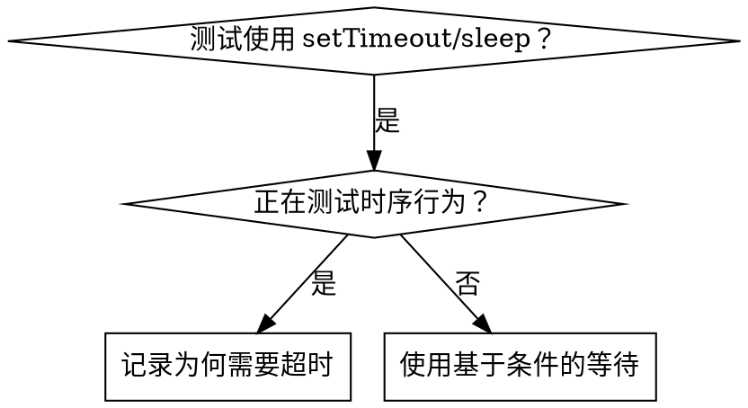

# 基于条件的等待

## 概述

不稳定测试经常用任意延迟猜测时序，造成竞态：在快机器上通过，在负载或 CI 环境下失败。

**核心原则：等待真正关心的条件，不要猜它需要多久。**

## 何时使用



**适用场景：**

- 测试含任意延迟（`setTimeout`、`sleep`、`time.sleep()`）；
- 测试偶发通过，在负载下失败；
- 并行运行时超时；
- 等待异步操作完成。

**不适用场景：**

- 测试真实时序行为，如防抖或节流间隔；
- 使用任意超时时必须记录原因。

## 核心模式

```typescript
// ❌ BEFORE: Guessing at timing
await new Promise(r => setTimeout(r, 50));
const result = getResult();
expect(result).toBeDefined();

// ✅ AFTER: Waiting for condition
await waitFor(() => getResult() !== undefined);
const result = getResult();
expect(result).toBeDefined();
```

## 快速模式

| 场景 | 模式 |
|------|------|
| 等待事件 | `waitFor(() => events.find(e => e.type === 'DONE'))` |
| 等待状态 | `waitFor(() => machine.state === 'ready')` |
| 等待数量 | `waitFor(() => items.length >= 5)` |
| 等待文件 | `waitFor(() => fs.existsSync(path))` |
| 复杂条件 | `waitFor(() => obj.ready && obj.value > 10)` |

## 实现

通用轮询函数：

```typescript
async function waitFor<T>(
  condition: () => T | undefined | null | false,
  description: string,
  timeoutMs = 5000
): Promise<T> {
  const startTime = Date.now();

  while (true) {
    const result = condition();
    if (result) return result;

    if (Date.now() - startTime > timeoutMs) {
      throw new Error(`Timeout waiting for ${description} after ${timeoutMs}ms`);
    }

    await new Promise(r => setTimeout(r, 10)); // Poll every 10ms
  }
}
```

完整实现见同目录的 [`condition-based-waiting-example.ts`](condition-based-waiting-example.ts)，其中包含来自实际调试的领域辅助函数 `waitForEvent`、`waitForEventCount` 和 `waitForEventMatch`。

## 常见错误

**❌ 轮询过快：** `setTimeout(check, 1)` 会浪费 CPU。

**✅ 修复：** 每 10ms 轮询一次。

**❌ 没有超时：** 条件永远不满足时会无限循环。

**✅ 修复：** 总是包含超时和清晰错误。

**❌ 使用陈旧数据：** 循环前缓存状态。

**✅ 修复：** 在循环内调用 getter 获取新数据。

## 任意超时何时正确

```typescript
// Tool ticks every 100ms - need 2 ticks to verify partial output
await waitForEvent(manager, 'TOOL_STARTED'); // First: wait for condition
await new Promise(r => setTimeout(r, 200));   // Then: wait for timed behavior
// 200ms = 2 ticks at 100ms intervals - documented and justified
```

要求：

1. 先等待触发条件；
2. 基于已知时序，不靠猜测；
3. 用英文代码注释解释原因。

## 实际效果

一次调试中，3 个文件里的 15 个不稳定测试得到修复，通过率从 60% 提升到 100%，执行时间缩短 40%，竞态消失。
